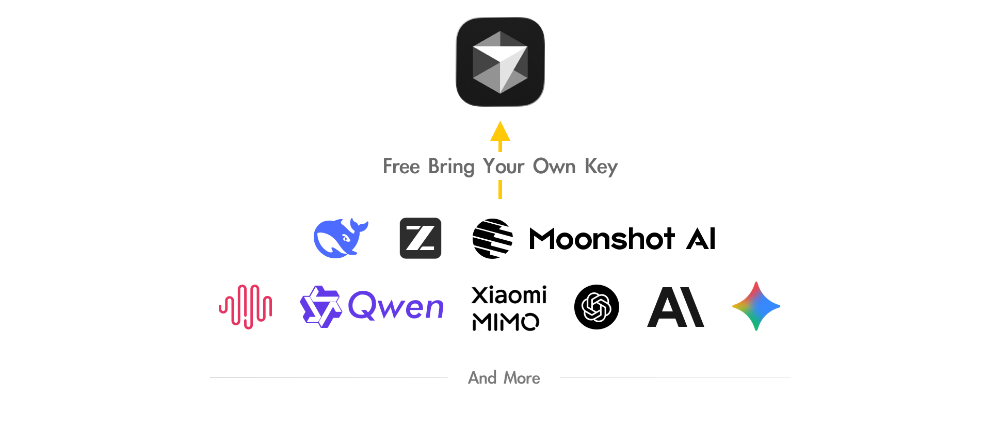
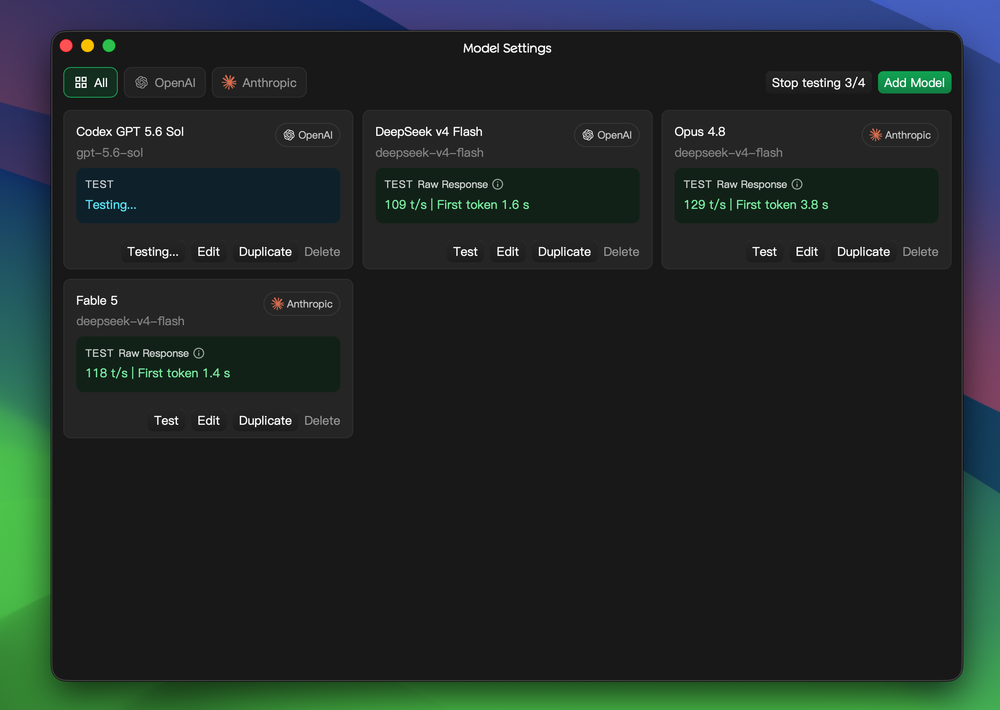

<div align="center">

# cursor-byok
cursor-byok is a local implementation of Cursor's backend.
<br>
<br>
<a href="https://trendshift.io/repositories/39260?utm_source=repository-badge&amp;utm_medium=badge&amp;utm_campaign=badge-repository-39260" target="_blank" rel="noopener noreferrer"></a>

[User Guide](https://docs.leokun.cn) · [Download](https://github.com/leookun/cursor-byok/releases/latest) · [Report an Issue](https://github.com/leookun/cursor-byok/issues) · [中文版本说明](./README-CN.md)


## 交流群组
https://t.me/cursor_byok


## 为什么做这个项目

公司喜欢把 Agent 服务与模型绑定在一起，让用户只能在指定模型、指定订阅和指定计费方式下使用工具。

我希望打破这种绑定关系：模型应该可以自由选择。开发者应该能够把自己的模型 API 接入到任何 IDE、Chat、Agent 或开发工具中，也可以自托管整套服务，避免被单一平台锁定。

这个项目的目标，是让模型选择权重新回到用户手里。

## 路线图

[正式版路线图](https://github.com/leookun/cursor-byok/discussions/32)
[详细使用教程](https://docs.leokun.cn)

## 后续

后续会继续扩展更多工具和使用场景，包括但不限于：

- 支持更多 IDE 接入
- 支持更多 Chat 类应用
- 支持更多 Agent 工具和工作流
- 提供更完善的自托管部署方式
- 持续优化不同模型 API 的兼容性
- 降低接入成本，让已有模型额度可以被更充分地利用

最终希望做到：让你的模型 API 可以自由接入到你想使用的任何工具中。
[](https://github.com/leookun/cursor-byok/releases/latest)
[](https://github.com/leookun/cursor-byok/releases)
[](./LICENSE)
[](https://github.com/leookun/cursor-byok/releases/latest)


</div>




## About

cursor-byok is an open-source local model gateway for Cursor. It runs a service on your machine that connects Cursor to the model APIs you configure, routes model requests through your own providers, and preserves Cursor Agent capabilities such as tool calling, Skills, and MCP.

You can connect OpenAI- and Anthropic-compatible services, customize endpoints, model IDs, API keys, and request parameters, and use model channels beyond the options built into the platform.

> [!IMPORTANT]
> cursor-byok is free and open source, but the model APIs you connect may charge for usage. This is an independent project and is not affiliated with or endorsed by Cursor or its developers.

## Features

- **Bring your own model channels:** Configure your own API endpoint, credentials, and model IDs.
- **Multiple API protocols:** Use OpenAI- and Anthropic-compatible APIs or a custom endpoint.
- **Model management:** Add, duplicate, edit, reorder, and batch-test multiple model configurations.
- **Connection benchmarks:** Measure time to first token, generation speed, and inspect raw provider responses.
- **Agent workflows:** Keep tool calling, Skills, MCP, and multi-turn conversations available.
- **Session metrics:** Track token usage, cache hit rate, conversation turns, and estimated value.
- **Cross-platform:** Run on macOS, Windows, and Linux.

## Quick Start

1. Download the latest build for your platform from [GitHub Releases](https://github.com/leookun/cursor-byok/releases/latest).
2. Launch cursor-byok, open **Model Settings**, and enter the endpoint, API key, and model ID.
3. Test the model configuration. Once it passes, return to the dashboard and start the service.
4. Open Cursor, select the configured model, and start using Agent.

For complete installation steps, system configuration, and troubleshooting, see the [User Guide](https://docs.leokun.cn).

## Model Management

Model configurations support both OpenAI and Anthropic API protocols. Each model channel can independently define its context window, maximum output tokens, reasoning effort, custom headers, and additional request parameters.



## How It Works

```text
Cursor client
    │
    │ Agent requests and tool results
    ▼
cursor-byok local service
    │
    │ OpenAI- / Anthropic-compatible requests
    ▼
Your model API
```

cursor-byok handles protocol adaptation, model request forwarding, tool-call coordination, and conversation state on your machine. API keys and application settings are stored locally; requests are still sent to the model provider you configure.

## Why This Project

Many Agent products bundle their tool capabilities with a fixed set of models, subscriptions, and billing options, leaving users limited to the channels offered by the platform.

cursor-byok is built to return model choice to the user. Developers can make full use of the APIs and credits they already have, choose the models and providers that fit their needs, and self-host related services when required.

## Roadmap

The project will continue to improve model compatibility, Agent tooling, local runtime stability, and the self-hosting experience while exploring support for more IDE, chat, and Agent workflows.

See the [release roadmap](https://github.com/leookun/cursor-byok/discussions/32) for plans and progress.

## Community and Support

- [User Guide](https://docs.leokun.cn)
- [GitHub Issues](https://github.com/leookun/cursor-byok/issues)
- [Telegram community](https://t.me/cursor_byok)
- QQ groups: `1095916242`, `1094411438`, `1095918002`, `1094419321`


## Development and Contributing

Issues and pull requests are welcome. See the [Contributing Guide](./CONTRIBUTING_EN.md) for prerequisites, build commands, project structure, and contribution guidelines.

## Contributors

<a href="https://github.com/leookun/cursor-byok/graphs/contributors">
  
</a>


## License

This project is open source under the [MIT License](./LICENSE).
